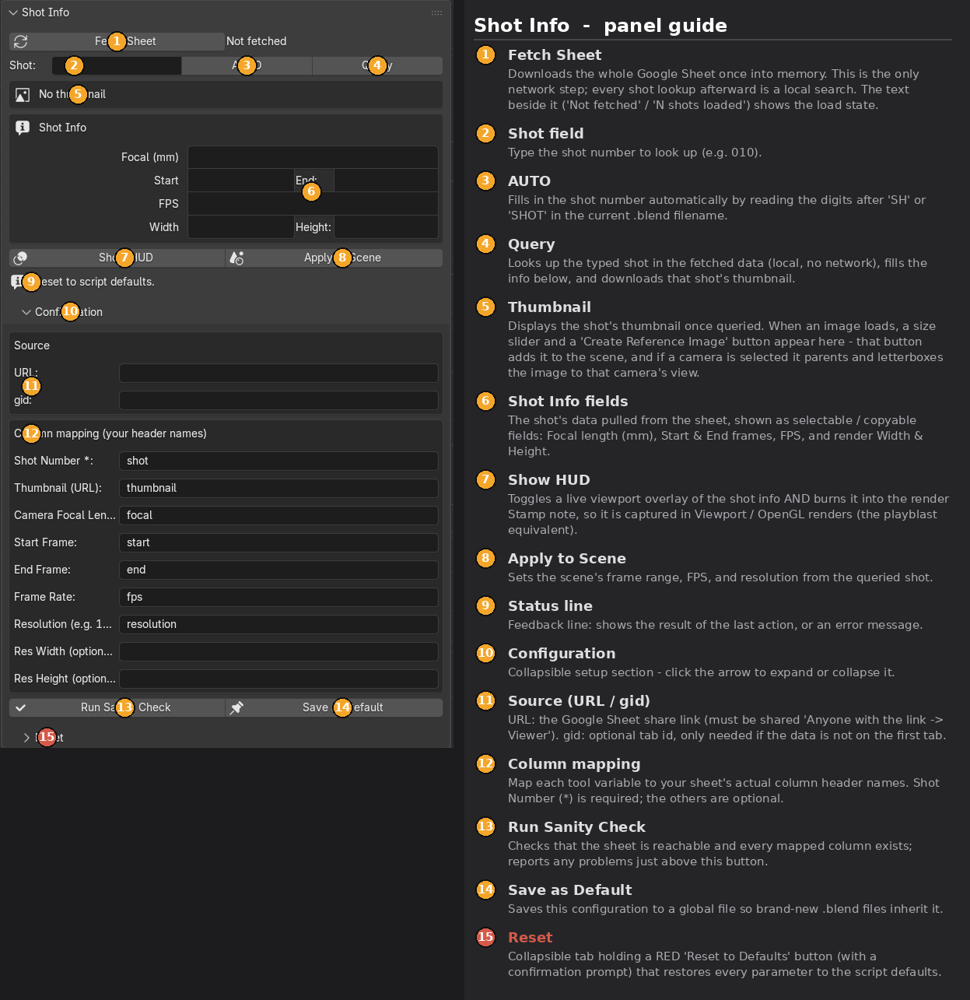

# jd_ShotInfoPanel_forBlender

Pulls per-shot production data from a **Google Sheet** into the Blender 3D
Viewport sidebar: a thumbnail, the shot's camera / frame-range / resolution
info, a viewport HUD, and one-click reference-image setup.

Current build: **`jd_ShotInfoPanel_forBlender_v1_0_0.py`** (version 1.0.0).

> The `_forBlender` tag and version suffix are per-DCC dev tracking; the panel
> itself still shows as **“Shot Info”** in the viewport sidebar.



## Features

- **One-step fetch, local lookups.** *Fetch Sheet* downloads the sheet once;
  every shot lookup after that is a local search — no repeated network calls.
- **Shot lookup + AUTO.** Type a shot number, or let *AUTO* read the digits
  after `SH` / `SHOT` in the current `.blend` filename.
- **Thumbnail.** Downloads only when a shot resolves, cached in Blender's temp
  dir. Handles `=IMAGE("url")` formula cells (see below).
- **Reference image.** Adds the thumbnail as an image-empty. If a camera is
  selected it's parented and **letterboxed** to the camera frame, with a
  `camera_distance` custom property (driver-driven) to slide it in/out.
- **Info fields.** Focal length, start/end frames, fps, and resolution, shown
  as selectable / copyable fields.
- **HUD.** Toggles a live viewport overlay *and* burns the info into the render
  Stamp note, so it's captured in Viewport / OpenGL renders (playblast).
- **Apply to Scene.** Sets the scene's frame range, fps, and resolution from
  the queried shot.
- **Config that travels.** Settings are saved in the `.blend`; *Save as Default*
  writes them to your Blender config dir so new files inherit them.

## Requirements

- Blender 3.0+ (**tested on 5.2**).
- The Google Sheet must be shared **“Anyone with the link → Viewer.”**
- No Python packages to install — uses only the standard library bundled with
  Blender.

## Install

1. Download `jd_ShotInfoPanel_forBlender_v1_0_0.py`.
2. In Blender: **Edit → Preferences → Add-ons → Install…**, select the file,
   and enable it. (Or open it in the Text Editor and **Run Script**.)
3. Open the **Shot Info** tab in the 3D Viewport sidebar (press `N`).

## Quick start

1. Expand **Configuration** and paste your sheet **URL**.
2. Under **Column mapping**, enter your sheet's real header names for each
   field (Shot Number is required).
3. Click **Run Sanity Check** to confirm the sheet is reachable and the columns
   exist.
4. Click **Fetch Sheet**, type a shot (or **AUTO**), then **Query**.

## Data model

Each **row** is a shot, each **column** a field. The sheet is read through the
CSV export endpoint:

```
https://docs.google.com/spreadsheets/d/<ID>/export?format=csv&gid=<GID>
```

### `=IMAGE()` thumbnails

Google's CSV export returns `=IMAGE("url")` formula cells as **empty**. When the
thumbnail column comes through blank, the add-on transparently recovers the URLs
from the XLSX export (which keeps the formula text), using only `zipfile` +
`xml.etree`. Plain URL columns are used as-is.

## Naming / versioning

- File: `jd_ShotInfoPanel_forBlender_v<major>_<minor>_<patch>.py` — underscores
  in the version because a Blender add-on's filename becomes its Python module
  name (dots/hyphens are invalid there).
- The human-readable version lives in `bl_info["version"]`.
- On-disk footprint is namespaced: config is saved as
  `jd_ShotInfoPanel_forBlender_config.json` in your Blender config dir, and
  thumbnails cache under `<temp>/jd_ShotInfoPanel_forBlender_thumbs/`.

## Notes

- The fit constants for the camera reference image are baked at creation time
  from the camera's lens / sensor / render aspect. Scrubbing `camera_distance`
  re-fits perfectly; if you change the lens or render resolution, re-run
  *Create Reference Image*.
- The live HUD overlay is screen-space UI and is **not** in rendered frames —
  the render **Stamp** is what gets captured.

## License

MIT — see [LICENSE](LICENSE). Swap it for whatever you prefer before publishing.
